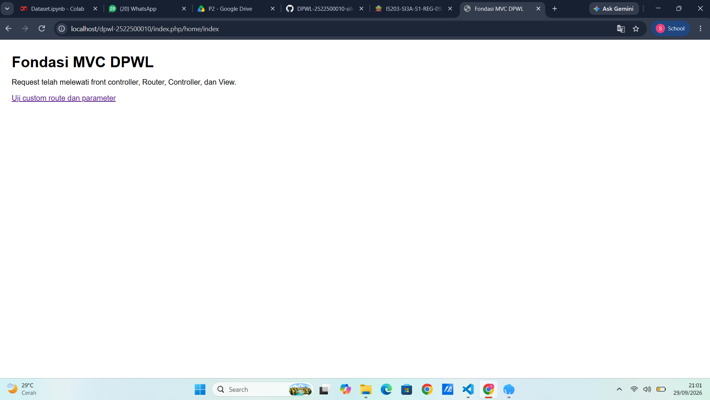
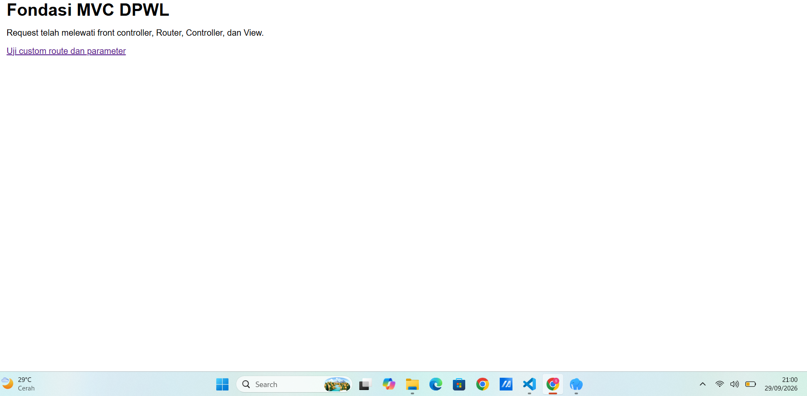

# Pertemuan 02 - Fondasi MVC Buatan Sendiri

## 1. Tujuan Praktikum

Tujuan P2 adalah memahami dan membuat fondasi MVC sederhana menggunakan PHP tanpa framework. Pada P2, saya belajar bagaimana request dari pengguna masuk melalui `index.php`, kemudian diproses oleh Router dan Controller sampai menghasilkan tampilan melalui View.

Selain itu, P2 juga bertujuan agar saya memahami struktur direktori, routing, Base Controller, Base URL, Helper, serta alur request-response sebagai dasar sebelum masuk ke P3.

## 2. Struktur Direktori

Struktur direktori P2 yang dibuat adalah:
BASE: C:\laragon\www\dpwl-2522500010
├─ application
│  ├─ config
│  │  ├─ config.php
│  │  └─ routes.php
│  ├─ controllers
│  │  └─ home.php
│  ├─ helpers
│  │  └─ url_helper.php
│  └─ views
│     └─ home
│        ├─ index.php
│        └─ info.php
├─ assets
│  └─ css
│     └─ app.css
├─ generatestrukturdirektorifile.php
├─ index.php
└─ system
   └─ core
      ├─ Controller.php
      └─ Router.php

Fungsi masing-masing bagian:

* `index.php` → sebagai **Front Controller** atau satu titik masuk utama aplikasi.
* `application/config/` → menyimpan konfigurasi aplikasi dan aturan routing.
* `application/controllers/` → menyimpan Controller aplikasi, yaitu `Home.php`.
* `application/helpers/` → menyimpan Helper, yaitu `url_helper.php`.
* `application/views/` → menyimpan tampilan aplikasi.
* `assets/css/` → menyimpan file CSS aplikasi.
* `system/core/Controller.php` → sebagai **Base Controller** yang menyediakan fungsi umum seperti `views()`.
* `system/core/Router.php` → bertugas membaca URI dan memetakan request ke Controller, method, dan parameter.

Folder `models` memang belum dibuat pada P2 karena akses basis data baru mulai diimplementasikan pada P3.

## 3. Front Controller

`index.php` berperan sebagai **Front Controller**, yaitu satu titik masuk utama untuk request aplikasi.

Ketika pengguna membuka route aplikasi, request terlebih dahulu masuk ke `index.php`. File ini kemudian memuat konfigurasi, Helper, class inti, dan `routes.php`, lalu menyerahkan URI kepada Router.

Jadi, sederhananya:

**Browser → `index.php` → Router → Controller → View → Response**

Dengan adanya `index.php` sebagai satu pintu masuk, request aplikasi menjadi lebih terstruktur dan tidak langsung mengakses Controller melalui path file.
 
## 4. Routing dan Pemetaan URL

| URL/Route          | Controller | Method   | Parameter   | View             |
| ------------------ | ---------- | -------- | ----------- | ---------------- |
| `/`                | Home       | index    | -           | `home/index.php` |
| `home/index`       | Home       | index    | -           | `home/index.php` |
| `home/info/mvc`    | Home       | info     | mvc         | `home/info.php`  |
| `info/routing`     | Home       | info     | routing     | `home/info.php`  |
| `home/[info/dpw ]` | Home       | [method] | [parameter] | [View]           |

Empat route pertama mengikuti route yang diberikan pada Modul P2. Route `/` menggunakan `Home::index()` sebagai default controller, sedangkan `info/routing` merupakan custom route yang diarahkan ke `Home::info('routing')`.


## 5. Base URL dan Helper

`base_url()` digunakan untuk membuat URL dasar aplikasi dan dapat digunakan untuk memanggil file aset seperti CSS.

Pada P2, contoh penggunaannya adalah:

```php
base_url('assets/css/app.css')
```

Hasilnya:

```text
http://localhost/dpwl-nim/assets/css/app.css
```

Sedangkan `site_url()` digunakan untuk membuat URL yang menuju route aplikasi.

Contohnya:

```php
site_url('info/routing')
```

Hasilnya:

```text
http://localhost/dpwl-nim/index.php/info/routing
```

Jadi, `base_url()` digunakan untuk **aset**, sedangkan `site_url()` digunakan untuk **navigasi atau route aplikasi**.

---

## 6. Alur Request-Response

### 1. Alur eksekusi P2

Alur request-response pada P2 adalah:

**Browser → `index.php` → Router → Controller → View → Response**

Contohnya ketika membuka:

```text
http://localhost/dpwl-nim/index.php/info/routing
```

Prosesnya:

1. Browser mengirim request ke `index.php` dengan path `info/routing`.
2. `index.php` memuat konfigurasi, Helper, class inti, dan `routes.php`.
3. Router mencocokkan `info/(:any)` dengan target `home/info/$1`.
4. Router membuat object `Home` dan memanggil `info("routing")`.
5. `Home::info()` memilih View `home/info` dan mengirim parameter `routing`.
6. View menghasilkan HTML dan response dikirim kembali ke browser.

### 2. Posisi Model dalam arsitektur MVC lengkap

Pada MVC lengkap, alurnya adalah:

**Browser → `index.php` → Router → Controller → Model → basis data/data → Model → Controller → View → Response**

Model berfungsi sebagai bagian yang menangani pengelolaan data dan basis data.

Namun, pada P2 Model **belum digunakan** karena P2 masih berfokus pada fondasi arsitektur, routing, Controller, View, Base URL, dan Helper. Akses basis data dan Model mulai diimplementasikan P3.

---

## 7. Hasil Pengujian dan Debugging

### Pengujian valid

| No. | URL                        | Hasil                                                           |
| --- | -------------------------- | --------------------------------------------------------------- |
| 1   | `/`                        | Halaman utama tampil melalui `default_controller`.              |
| 2   | `/index.php/home/index`    | Pemetaan langsung Controller dan method berhasil.               |
| 3   | `/index.php/home/info/mvc` | Parameter `mvc` tampil pada View.                               |
| 4   | `/index.php/info/routing`  | Custom route berhasil dan parameter `routing` tampil pada View. |

Hasil pengujian tersebut sesuai dengan skenario pengujian yang diberikan dalam Modul P2.

### Pengujian tidak valid

| No. | URL                        | Hasil                                 |
| --- | -------------------------- | ------------------------------------- |
| 5   | `/index.php/tidakada`      | HTTP 404: Controller tidak ditemukan. |
| 6   | `/index.php/home/tidakada` | HTTP 404: Method tidak ditemukan.     |

Pengujian ini dilakukan untuk memastikan Router dapat menangani request yang tidak sesuai.

### Pemeriksaan sintaks PHP

Pemeriksaan sintaks dilakukan menggunakan perintah:

```bash
php -l index.php
php -l application\config\config.php
php -l application\config\routes.php
php -l application\helpers\url_helper.php
php -l application\controllers\Home.php
php -l system\core\Controller.php
php -l system\core\Router.php
```

Jika muncul:

```text
No syntax errors detected
```

berarti file tersebut tidak memiliki kesalahan sintaks PHP. Setelah itu, pengujian route tetap perlu dilakukan untuk memastikan aplikasinya berjalan sesuai yang diharapkan.

### Debugging

Jika ditemukan error, proses debugging dicatat dengan urutan:

**Gejala → Penyebab → Perbaikan → Hasil Uji Ulang**

Contohnya, jika custom route tidak berjalan:

* **Gejala:** URL custom route tidak dapat menampilkan halaman.
* **Penyebab:** pola route atau target Controller/method tidak sesuai.
* **Perbaikan:** memperbaiki aturan route pada `application/config/routes.php`.
* **Hasil uji ulang:** custom route dapat menampilkan View dan parameter sesuai yang diharapkan.

## 8. Bukti Tangkapan Layar

### Gambar 1. Hasil Pengujian Halaman Utama

```markdown

```
### Gambar 2. Hasil Pengujian Custom Route

```markdown


## 9. Kesimpulan P2

Pada P2, saya sudah dapat membuat fondasi MVC sederhana menggunakan PHP tanpa framework. Aplikasi sudah memiliki `index.php` sebagai Front Controller, Router untuk memetakan URL, Controller untuk menangani request, dan View untuk menampilkan hasil kepada pengguna.

Pada P3, kerangka P2 akan dikembangkan dengan menambahkan **Model, koneksi basis data, MySQLi/prepared statement, autentikasi, sesi, kontrol akses, dan integrasi AdminLTE**. Jadi, P3 melanjutkan kerangka yang sudah dibuat pada P2.


